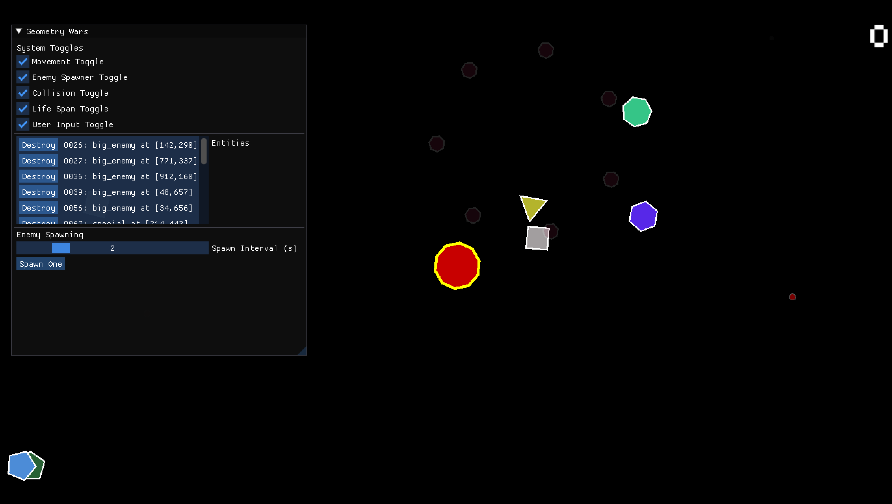

# Simple 2D Game
Learning game programming with C++ from COMP4300 Game Programming course found on youtube - https://youtu.be/-ugbLQlw_VM?si=0Ri8qIUXbwopQyPa



## Build from source
Clone git repository with the dependencies included as submodules:

`git clone --recursive https://github.com/GericoVi/simple_2d_game.git`

Build using cmake:

```
cd simple_2d_game
mkdir build
cd build

cmake ..
cmake --build .
```

Otherwise you can manually install dependencies and link:

[SFML](https://github.com/SFML/SFML), [ImGUI](https://github.com/ocornut/imgui), [ImGUI-SFML](https://github.com/SFML/imgui-sfml)

# Program Specification
From assignment specification in course/video.

## Player
- Represented by a shape which is defined in the config file
- Must spawn in the centre of the screen at the beginning of the game, and after it dies (collides with an enemy)
- Moves by a speed read from the config file in standard WASD controls
- Confined to move in bounds of window
- Shoots bullet toward mouse pointer when left button is clicked. Speed, size, and lifespan of bullets are read from the config file.

## Special ability
- Right mouse button first special ability
- Multiple entities spawns with unique graphic
- Unique game mechanic?
- Cooldown timer for using this


## Enemies
- Spawn in a random location on screen every X frames, X is defined in config
- Shouldn't overlap sides of screen at time of spawn
- Shape has random number of vertices, between min and max specified in config
- Shape radius specified in config file
- Random colour upon spawning
- Random speed upon spawning between min and max specified in config
- Should bounce of edges of window (same speed)
- When hit with bullet, should be destroyed and N small enemies spawn in its place, where N is number of vertices of original enemy. Each of this have the same number of vertices and colour as the original. These travel outward at angled at a fixed interval equal to (360 / num. vertices).

## Score
- Each time enemy spawns, it's given a score components of num_vertices*100. Small enemies get double this value each
- Player destroying an enemy adds the relevant score
- Current score should be displayed at top-left corner of screen, with font specified in config


## Drawing
- All entities should be given a slow rotation (mostly just visuals, won't be accounted for in collision)
- Lifespan visualised as transparency/alpha. 255 alpha when first spawned to 0 on the last frame it's alive - should linearly change.

## GUI
- Display options to turn off each system independently
- For each entity in the game, list ID, tag, and position. Display all entities, as well as lists of entities by tag. Must have a way to destroy a given entity by interacting with the UI element associated with it
- Must be able to change enemy spawn interval
- Must be able to manually spawn enemies

## Misc.
- 'P' key should pause game
- 'Esc' key should close game

## Config file
Has one line each specifying the window size, font format, player, bullet specification, and enemy specifications.

Lines given in that order with syntax:

Window W H FL FS
- SFML window must be constructed with width W and height H (integers). FL (int) is frame limit, FS (int 1,0) specifies whether to display the application in full-screen mode.

Font F S R G B
- Font File     F       std::string (no space)
- Font Size     S       int
- RGB Color     (R,G,B) int, int, int

Player SR CR S FR FG FB OR OG OB OT V
- Shape Radius      SR          int
- Collision Radius  CR          int
- Speed             S           float
- Fill Color        FR,FG,FB    int,int,int
- Outline Color     OR,OG,OB    int,int,int
- Shape Vertices    V           int

Enemy SR CR SMIN SMAX OR OG OB OT VMIN VMAX L SI
- Shape Radius          SR          int
- Collision Radius      CR          int
- Min/Max Speed         SMIN,SMAX   float,float
- Outline Color         OR,OG,OB    int,int,int
- Outline Thickness     OT          int
- Min/Max Vertices      VMIN,VMAX   int,int
- Small Lifespan        L           int
- Spawn Interval        SI          int

Bullet SR CR S FR FG FB OR OG OB OT V L
- Shape Radius          SR          int
- Collision Radius      CR          int
- Speed                 S           float
- Fill Color            FR,FG,FB    int,int,int
- Outline Color         OR,OG,OB    int,int,int
- Outline Thickness     OT          int
- Shape Vertices        V           int
- Lifespane             L           Int
